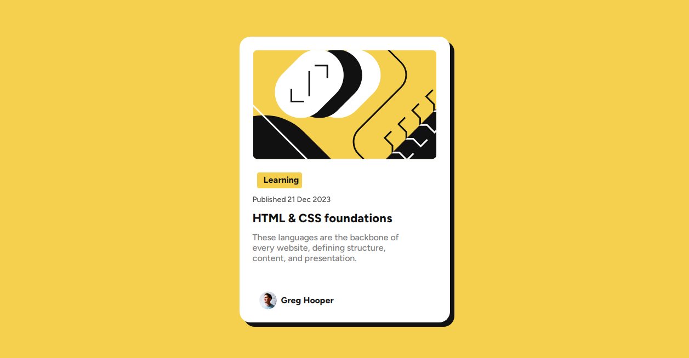

# Frontend Mentor - Blog preview card

## Overview

A Blog preview card based basic HTML and CSS

This component is designed to provide a visually appealing and informative preview of blog articles, with a focus on learning and engagement.

## Features:

    - Responsive design for various screen sizes
    - Interactive hover effect on title
    - Clear and concise display of article information
## Usage:

Simply copy and paste the HTML and CSS code into your project to use this component. Customize as needed to fit your blog's style and branding.

### Links

- Live Site URL: [Blod preview card](https://blog-preview-card-100.netlify.app/)

### Built with

- Semantic HTML5 markup
- CSS custom properties
- Flexbox
- Mobile-first workflow

## Author

- Frontend Mentor - [@kingsley](https://www.frontendmentor.io/profile/kingsley2o18)

## Acknowledgments

Fronted Mentor

### Screenshot

